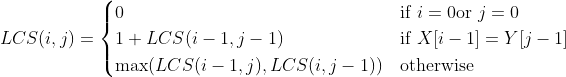
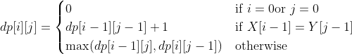

-# Practical Work: Longest Common Subsequence (LCS)

## Objectives

The objective of this practical session is to understand and implement two different approaches to solve the Longest Common Subsequence (LCS) problem:

1. A recursive approach with or without memoization.  
2. A dynamic programming approach using the bottom-up method.

Students should also explore ways to automatically generate test data to validate their solutions.

## Problem

Given two strings `X` and `Y`, the Longest Common Subsequence (LCS) between these two strings is the longest sequence of characters that appears in the same order in both strings, but not necessarily consecutively.

### Example

- If `X = "ABCBDAB"` and `Y = "BDCAB"`, then a possible LCS is `"BCAB"` or `"BDAB"`, of length 4.
- If `X = "AXYT"` and `Y = "AYZX"`, the LCS is `"AY"`, of length 2.

---

## Instructions

### Step 1: Recursive Implementation

- Implement a recursive solution based on the following recurrence relation:




- Test this implementation on short strings to avoid long execution times.
- Extend this approach by adding memoization to improve its efficiency.

### Step 2: Dynamic Programming Approach (Bottom-Up)

- Implement a solution based on dynamic programming. Construct a `dp` table of dimensions `(m+1) * (n+1)`, where `m` and `n` are the lengths of strings `X` and `Y`. Fill this table according to the rules:




- Use this table to retrieve an LCS by traversing the data in reverse order.

### Step 3: Implement String Generator

In the file `complexity/generator.py`, you'll find a TODO to implement string generation logic. Complete the `StringGenerator` class:

```python
class StringGenerator(DataGenerator):
    def __init__(self, alphabit=['A','B','C']):
        pass
    def generate(self, size: int = 1) -> str:
        pass
```

Your implementation should:
1. Initialize the generator with a list of characters (alphabet)
2. Implement the `generate` method to create random strings of a given size
3. Add the following features:
   - Generate random strings using characters from the provided alphabet
   - Add methods to generate pairs of strings with lengths `m` and `n`
   - Include functionality to create almost identical or entirely different strings
   - The return type of `generate` should be `str`, not `int` (fix the type hint)

Example usage after implementation:
```python
# Create generator with DNA alphabet
gen = StringGenerator(['A', 'C', 'G', 'T'])

# Generate single string
dna_string = gen.generate(10)  # e.g., "ACGTACGTAC"

# Generate pair of strings
str1, str2 = gen.generate_pair(5, 8)  # Different lengths
```

Test your implementation with different alphabets and string lengths to ensure it works correctly.

---

## Tasks

1. Implement a recursive solution with and without memoization.  
2. Implement a dynamic programming (bottom-up) solution.  
3. Compare the two approaches in terms of performance (execution time and memory consumption).  
4. Test your solutions on artificially generated data, including simple and extreme cases.  
5. Document your observations and conclusions in a concise report.

The implementation will be  in `examples/common_string.py` where you'll find a TODO comment.

---

## Possible Extension

Optimize the memory consumption of the dynamic programming approach by reducing the `dp` table to two 1D arrays.
